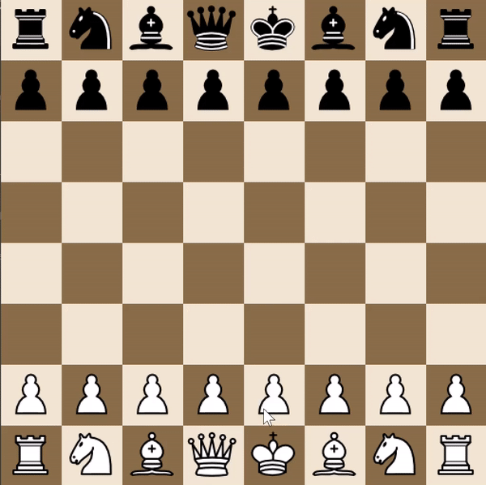

**Cheess Engine**

Custom chess engine following FIDE chess rules implemented in plain Python with pygame library for visualization.

**Normal game mode**

Game mode to interact with visual chess board via mouse click. Moves and pieces are highlighted on chessboard using pygame.

**Perft (Performance testing) of engine**

Automatically evaluating and testing the chess engine using all allowed moves.
Compares to challenging test cases to evaluate edge case situations that rarely happen (En-passant, pins, hidden checks, double checks etc.).
Number of recursively searched nodes are compared to Stockfish (a strong chess engine) to ensure correct behaviour.

